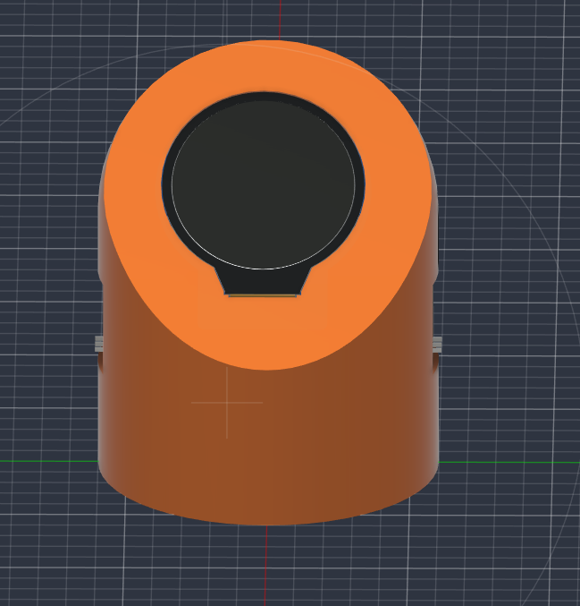
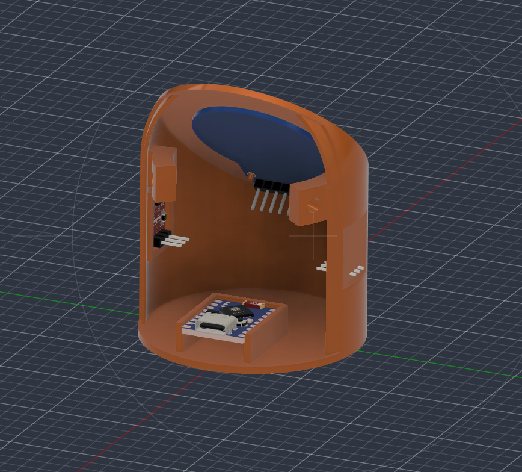
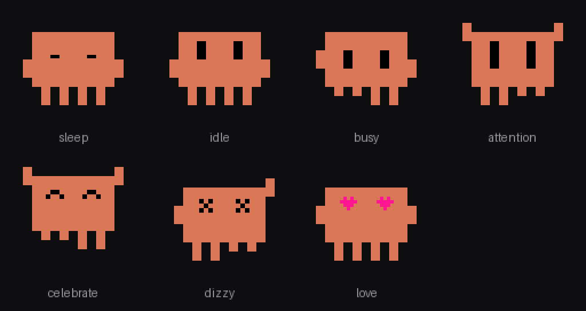
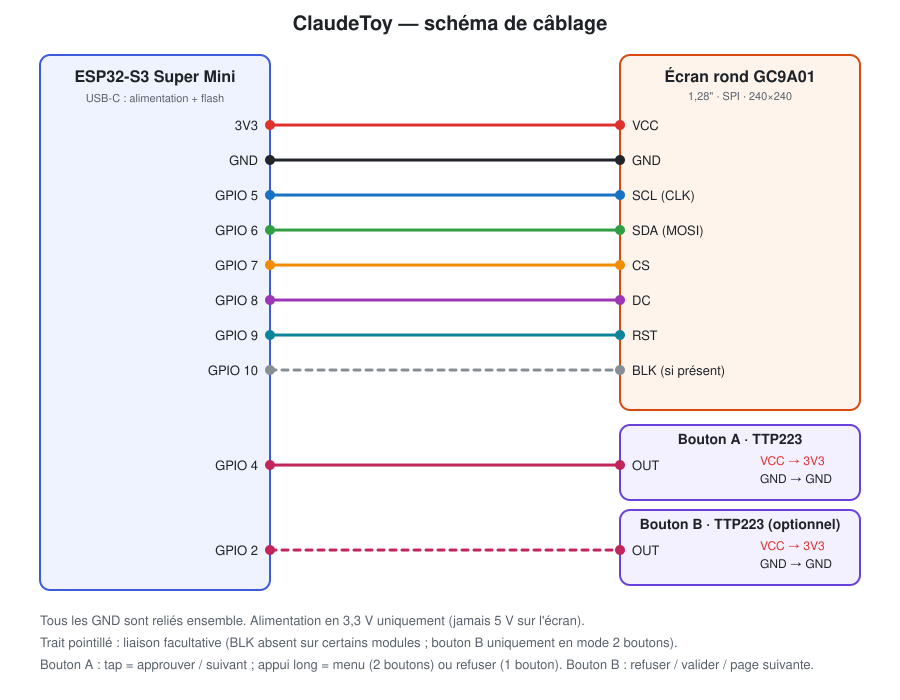

# ClaudeToy

Un petit compagnon physique pour Claude Desktop : un écran rond avec **Clawd**, la mascotte pixel-art de
Claude Code, qui réagit à ce que fait Claude (au travail, en attente de validation, terminé…) et te laisse
**approuver ou refuser** les demandes de permission depuis un bouton tactile.

*A tiny physical Claude Desktop companion on an ESP32-S3 + round GC9A01 display, with touch buttons to approve or deny
permission prompts. Port of the official [claude-desktop-buddy](https://github.com/anthropics/claude-desktop-buddy)
(M5StickC Plus) to other hardware, with a 3D-printable case.*

<table>
  <tr>
    <td align="center"><br><sub>Face avant : l'écran rond sur la face inclinée</sub></td>
    <td align="center"><br><sub>Vue arrière (trappe retirée) : ESP32-S3 et modules dans le corps</sub></td>
  </tr>
</table>

> **Base logicielle :** la partie logicielle de ce projet (firmware, protocole Bluetooth, animaux, menus, statistiques) repose en grande
> partie sur le projet [anthropics/claude-desktop-buddy](https://github.com/anthropics/claude-desktop-buddy) (licence MIT, © Anthropic, PBC),
> adapté ici à d'autres composants. Voir [Licence et crédits](#licence-et-crédits).
>
> Projet communautaire non officiel, sans lien avec Anthropic. La fonction « Hardware Buddy » de Claude Desktop est
> réservée au mode développeur et n'est pas une fonctionnalité officiellement supportée.

## Ce que ça fait

<p align="center"><br><sub>Les sept états de Clawd (rendu illustratif de l'animation du firmware)</sub></p>

- **Clawd réagit à Claude** : il dort, attend, travaille, s'inquiète quand une permission est demandée, fête une réussite…
- **Approbation physique** : tap pour approuver, un autre geste (ou un 2e bouton) pour refuser.
- **Écran de veille** : heure et date, tokens du jour, niveau et progression, sessions en cours/en attente,
  état du Bluetooth, dernier message de Claude.
- **Bluetooth LE chiffré** avec appairage par code à 6 chiffres affiché à l'écran.

## Informations affichées

Tout vient de Claude Desktop, par Bluetooth LE : l'état des sessions, les tokens, les dernières lignes du transcript,
la demande de permission en cours (outil + commande), l'heure et ton prénom. Rien ne transite par Internet.

| Écran | Quand | Contenu |
| ----- | ----- | ------- |
| **Veille** | aucune session en cours ni en attente | Heure (deux-points clignotants) et date ; **tokens du jour** ; **niveau** (Lv) avec barre de progression vers le suivant (50 000 tokens par niveau) ; sessions **en cours** et **en attente** ; état du **Bluetooth** (vert = chiffré, orange = non chiffré, gris = déconnecté) ; **dernier message** de Claude sur 2 lignes ; avec la status line : **modèle, effort et % de contexte** (ex. `Opus 4.5 high 42%`) |
| **Bague de contexte** | dès que la status line de Claude Code est branchée (voir plus bas) | 60 points autour du bord de l'écran, remplis dans le sens horaire selon le **contexte utilisé** : vert, puis jaune (60 %), orange (80 %) et rouge (90 %). Disparaît si plus rien n'arrive pendant 30 minutes |
| **Activité** | au moins une session en cours | Clawd en grand et les 3 dernières lignes du transcript (défilement avec le bouton B) |
| **Demande de permission** | Claude attend une validation | Délai d'attente (rouge après 10 s), **nom de l'outil** (ex. `Bash`), **commande ou fichier concerné** sur 2 lignes, rappel des gestes pour approuver ou refuser |
| **Pet** (tap pour y accéder) | à la demande | Page 1 : humeur (4 cœurs), faim (10 pastilles), énergie, niveau, nombre d'approbations et de refus, tokens totaux et du jour. Page 2 : explications |
| **Info** (tap) | à la demande | 6 pages : à propos, boutons, **Claude** (sessions, état du lien, ancienneté du dernier message), **appareil** (durée de fonctionnement, mémoire libre, luminosité), **Bluetooth** (nom `Claude-XXXX`, adresse, marche à suivre), crédits |
| **Menu** (appui long ou double tap) | à la demande | Réglages (luminosité, son, LED, ordre des écrans, changement d'animal, réinitialisation), éteindre, aide, mode démo |
| **Appairage** | première connexion | Code à 6 chiffres à saisir sur l'ordinateur |
| **Démarrage** | allumage | « Hello! » ou « *Prénom*'s Clawd » |

### Les états de Clawd

| État | Déclencheur |
| ---- | ----------- |
| sleep | nuit (1 h – 7 h), week-end, ou les 12 s après le réveil de l'écran |
| idle | connecté, rien d'urgent |
| busy | au moins une session en cours (le projet d'origine attendait 3 sessions) |
| attention | une permission attend ta réponse |
| celebrate | tâche terminée, ou niveau gagné |
| heart | permission approuvée en moins de 5 s |
| dizzy | secousse (nécessite un IMU, absent de ce montage) |

Sans IMU et sans batterie, certaines valeurs restent figées : la sieste et l'énergie ne varient pas, et l'écran
« appareil » affiche 0 % de batterie.

## Status line Claude Code (modèle, effort, contexte)

Claude Desktop n'envoie par Bluetooth ni le modèle, ni le niveau d'effort, ni le contexte. Un **mod Claude Code**,
[`mod/claudetoy-statusline`](mod/claudetoy-statusline), les lit et les envoie à la carte par le **port USB** : modèle, effort,
% de contexte et quotas 5 h / 7 j (uniquement ces champs : ni dossier de travail, ni dépôt Git). Il fonctionne dans
Claude Desktop (onglet Code) comme dans la CLI, et n'affiche rien dans Claude.

```bash
pip install pyserial
claude plugin marketplace add neoisback431/ClaudeToy
claude plugin install claudetoy-statusline@claudetoy
```

Puis `claude plugin list` doit indiquer le plugin comme chargé ; relance Claude Desktop. Si tu avais un bloc `statusLine`
pointant vers le script, retire-le de `~/.claude/settings.json` pour éviter un double envoi. Options du plugin (`/config`) :
`python` (exécutable, `python` par défaut) et `refreshSeconds` (5 par défaut).

- **Testé avec Claude Desktop** : modèle, contexte, quotas et effort remontent sur la bague. Le mod a besoin d'une version de
  Claude Code qui gère les mods ; sinon `claude plugin list` affiche une erreur de chargement.
- **Sans le mod** (CLI seule) : le script [`claudetoy_statusline.py`](mod/claudetoy-statusline/claudetoy_statusline.py) peut aussi
  servir de status line, dans `~/.claude/settings.json` :
  `"statusLine": {"type": "command", "command": "python C:/chemin/vers/mod/claudetoy-statusline/claudetoy_statusline.py", "refreshInterval": 5}`
  (barres obliques `/` sous Windows).
- L'effort est lu à chaque requête au modèle : il reste vide jusqu'à la première réponse d'une session.
- La carte doit être branchée en USB au PC qui exécute Claude Code. Si le port est occupé (flash, moniteur série) ou la carte absente,
  l'envoi est simplement ignoré.
- Les quotas 5 h / 7 j ne sont fournis que pour les abonnements Pro et Max, et le contexte reste inconnu pendant la première minute
  d'une session.
- Avec plusieurs sessions, la dernière valeur reçue s'affiche.
- L'effort est abrégé (`medium` devient `med`) et le nom du modèle est raccourci pour tenir à l'écran.
- Le script garde ses 100 derniers passages dans `%TEMP%\claudetoy_statusline.log` (heure, session, valeurs envoyées) pour diagnostiquer.
- Format du message (une ligne JSON) : `{"cc":{"m":"Opus 4.5","e":"high","c":42,"h":23,"d":41}}` (`-1` = inconnu).

## Nomenclature (BOM)

| Qté | Composant | Remarque |
| --- | --------- | -------- |
| 1 | ESP32-S3 Super Mini | USB natif et BLE 5. Ne convient pas : ESP32-C3 (pas de tactile natif, moins à l'aise) ni ESP8266 (pas de BLE) |
| 1 | Écran rond GC9A01 1,28" SPI, 240×240 | Versions à 7 ou 8 broches ; la broche BLK (rétroéclairage) est facultative |
| 1 à 2 | Module tactile capacitif TTP223 | 1 en mode 1 bouton, 2 en mode 2 boutons |
| 1 | Câble USB-C (données) | Alimentation et flash |
| — | Fils souples ou Dupont, barrettes à souder | 7 à 8 fils pour l'écran, 3 par module tactile |
| — | Fixations (vis, colle) | Selon ton montage |
| 1 | Corps principal imprimé en 3D | [`3dParts/Corps principal.stl`](3dParts/Corps%20principal.stl) |
| 1 | Trappe imprimée en 3D | [`3dParts/Trappe.stl`](3dParts/Trappe.stl) |

Optionnel, **non géré par le firmware** : accu Li-ion rechargeable et chargeur, schéma dans [BATTERY.md](BATTERY.md).

## Câblage

<p align="center"></p>

| Écran GC9A01 | ESP32-S3 |   | Module tactile | ESP32-S3 |
| ------------ | -------- | - | -------------- | -------- |
| VCC | 3V3 | | A : OUT | GPIO 4 |
| GND | GND | | B : OUT (optionnel) | GPIO 2 |
| SCL | GPIO 5 | | VCC (A et B) | 3V3 |
| SDA | GPIO 6 | | GND (A et B) | GND |
| CS | GPIO 7 | | | |
| DC | GPIO 8 | | | |
| RST | GPIO 9 | | | |
| BLK (si présent) | GPIO 10 | | | |

Détails et conseils : [WIRING.md](WIRING.md).

## Boîtier 3D

| Fichier | Contenu |
| ------- | ------- |
| [`3dParts/Corps principal.stl`](3dParts/Corps%20principal.stl) | Corps cylindrique, environ 60 × 60 × 74 mm, face supérieure inclinée pour l'écran |
| [`3dParts/Trappe.stl`](3dParts/Trappe.stl) | Trappe d'accès, environ 22 × 58 × 71 mm |
| [`3dParts/claude_toy.f3z`](3dParts/claude_toy.f3z) | Projet complet Fusion (archive) |
| [`3dParts/claud_toy.f3d`](3dParts/claud_toy.f3d) | Modèle Fusion |

Les dimensions ci-dessus sont lues dans les fichiers STL. Les fichiers Fusion permettent d'adapter le boîtier
(emplacement des modules, taille de la carte).

## Compiler et flasher

```bash
pip install platformio esptool
python -m platformio run -t upload
```

L'upload passe par l'esptool récent (PlatformIO embarque une version qui rate le reset automatique sur l'USB natif
de l'S3). Si la carte n'est pas détectée : maintenir **BOOT**, rebrancher l'USB, relâcher après 2 s.

## Appairage avec Claude Desktop

**Documentation officielle :** [section « Pairing » du dépôt claude-desktop-buddy](https://github.com/anthropics/claude-desktop-buddy#pairing)
et [protocole détaillé (REFERENCE.md)](https://github.com/anthropics/claude-desktop-buddy/blob/main/REFERENCE.md#enabling-the-bridge).

En résumé :

1. Dans Claude Desktop (macOS ou Windows) : `Help → Troubleshooting → Enable Developer Mode`.
2. `Developer → Open Hardware Buddy…` puis **Connect** et choisir `Claude-XXXX`.
3. Saisir le code à 6 chiffres affiché sur l'écran.

Ensuite, la reconnexion est automatique. Le pont Bluetooth n'est disponible qu'en mode développeur : ce n'est pas une
fonctionnalité officiellement supportée.

## Boutons

Mode 2 boutons (par défaut, `-DBUDDY_BTNB_PIN=2`) :

| Bouton | Action |
| ------ | ------ |
| A, tap | approuver / écran suivant |
| A, appui long | menu |
| B | refuser / valider / page suivante |

Mode 1 bouton (commenter `BUDDY_BTNB_PIN`) : tap = A, appui long = B, double tap = menu.

## Ce qui change par rapport à l'original

- Couche de compatibilité `src/M5StickCPlus.h` + `src/m5shim.cpp` : l'API M5Stack est émulée (écran TFT_eSPI, rétroéclairage PWM,
  boutons tactiles, horloge logicielle), le reste du firmware est quasi inchangé.
- Nouvelle espèce `clawd` ([src/buddies/clawd.cpp](src/buddies/clawd.cpp)), dessinée en pixels, avec les 7 états animés.
- Tableau de bord de veille (heure, tokens du jour, niveau, sessions, Bluetooth, dernier message).
- Interface réduite à 135×208 px, centrée dans le cercle.
- Bague de contexte et ligne modèle/effort alimentées par la status line de Claude Code, via USB.

## État

- Testé sur le matériel : compilation, flash, affichage, mode 1 bouton, appairage Bluetooth avec Claude Desktop.
- Mode 2 boutons : implémenté, pas encore validé sur le matériel.
- Pas d'IMU : pas de secousse, de sieste face cachée ni d'horloge paysage. Pas de gestion de batterie dans le firmware.
- Les personnages GIF ne sont pas fournis (les GIF « bufo » du dépôt d'origine sont des œuvres de tiers) ; voir
  `tools/prep_character.py` et `tools/flash_character.py`.

## Licence et crédits

**Ce projet est un dérivé de [anthropics/claude-desktop-buddy](https://github.com/anthropics/claude-desktop-buddy)**
(licence MIT, © 2026 Anthropic, PBC). La partie logicielle s'appuie en grande partie sur ce dépôt, repris et adapté :

| Repris du projet d'origine (avec adaptations légères) | Ajouté ou réécrit ici |
| ------------------------------------------------------ | --------------------- |
| Protocole Bluetooth LE et appairage chiffré (`ble_bridge`) | Couche de compatibilité M5StickC Plus → ESP32-S3 (`M5StickCPlus.h`, `m5shim.cpp`) |
| Réception des données de Claude Desktop, statistiques, niveaux (`data.h`, `stats.h`, `xfer.h`) | Espèce `clawd` en pixel-art et ses animations |
| Moteur d'animation, 18 animaux ASCII, personnages GIF (`buddy`, `character`, `buddies/`) | Tableau de bord de veille |
| Menus, réglages, écrans Pet et Info, scripts `tools/` | Gestes sur boutons tactiles, mode 1 ou 2 boutons |
| | Câblage, documentation, boîtier 3D |

La licence MIT d'origine est conservée telle quelle dans [LICENSE](LICENSE), comme elle l'exige. Merci aux auteurs du
projet d'origine, dont le dépôt contient aussi la documentation complète du protocole.

Clawd est la mascotte de Claude Code ; le dessin pixel-art de ce dépôt est une réinterprétation non officielle.
